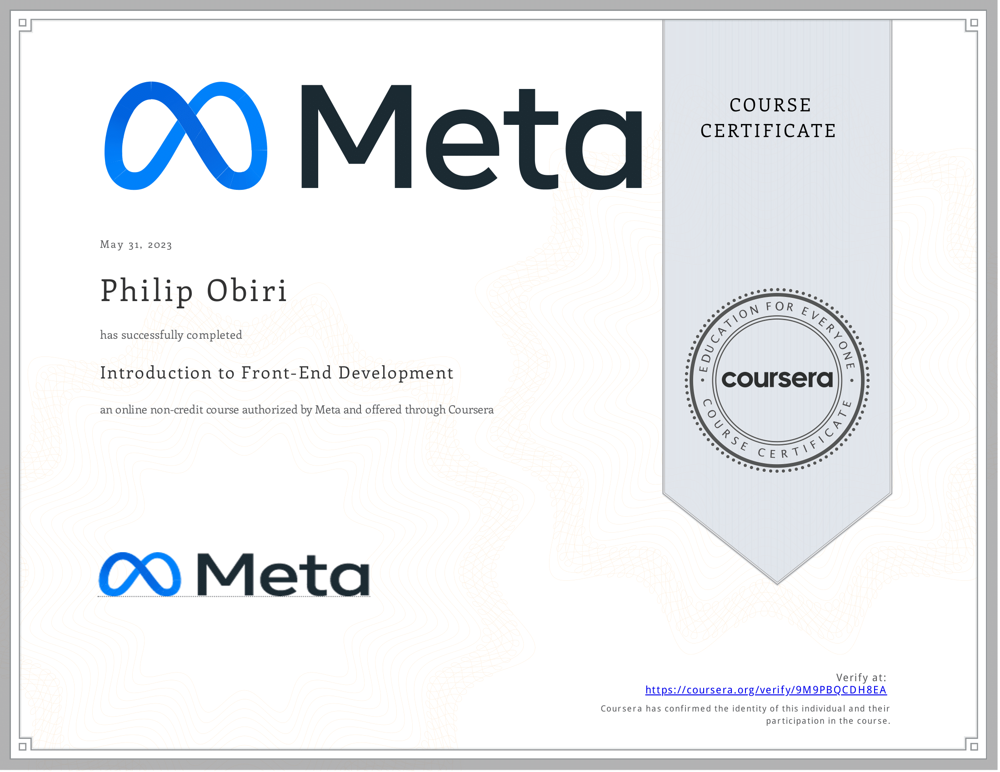

# Introduction to Front-End Development

- This directory contains all of my assignments from the Coursera Course: [Introduction to Front-End Development](https://www.coursera.org/learn/introduction-to-front-end-development?specialization=meta-front-end-developer)

## Table of Content

- Week 1: [Get started with web development](https://github.com/philipObiri/Meta-Frontend-Professional-Certification-Program/tree/master/Course%201-Introduction%20to%20FrontEnd%20Development/Week%201)
- Week 2: [Introduction to HTML and CSS](https://github.com/philipObiri/Meta-Frontend-Professional-Certification-Program/tree/master/Course%201-Introduction%20to%20FrontEnd%20Development/Week%202)
- Week 3: [UI Frameworks](https://github.com/philipObiri/Meta-Frontend-Professional-Certification-Program/tree/master/Course%201-Introduction%20to%20FrontEnd%20Development/Week%203)
- Week 4: [End-of-Course Graded Assessment](https://github.com/philipObiri/Meta-Frontend-Professional-Certification-Program/tree/master/Course%201-Introduction%20to%20FrontEnd%20Development/Week%204)

## Proof of Completion

