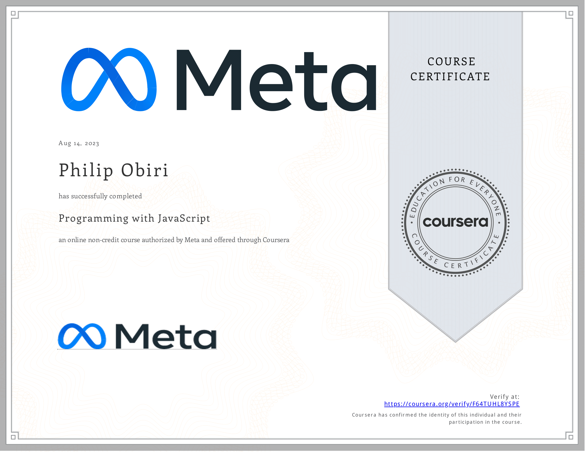

# Programming with JavaScript

- This directory contains all of my assignments from the Coursera Course: [Programming with JavaScript](https://www.coursera.org/learn/programming-with-javascript?specialization=meta-front-end-developer)

## Table of Content

- Week 1: [Introduction to Javascript](https://github.com/philipObiri/Meta-Frontend-Professional-Certification-Program/tree/master/Course%202-Programming%20With%20JavaScript/Week%201)
- Week 2: [The Building Blocks of a Program](https://github.com/philipObiri/Meta-Frontend-Professional-Certification-Program/tree/master/Course%202-Programming%20With%20JavaScript/Week%202)
- Week 3: [Programming Paradigms](https://github.com/philipObiri/Meta-Frontend-Professional-Certification-Program/tree/master/Course%202-Programming%20With%20JavaScript/Week%203)
- Week 4: [Testing](https://github.com/philipObiri/Meta-Frontend-Professional-Certification-Program/tree/master/Course%202-Programming%20With%20JavaScript/Week%204)
- Week 5: [End-of-Course Graded Assessment](https://github.com/philipObiri/Meta-Frontend-Professional-Certification-Program/tree/master/Course%202-Programming%20With%20JavaScript/Week%205/1.programming-assignment-little-lemon-receipt-maker)

## Proof of Completion

