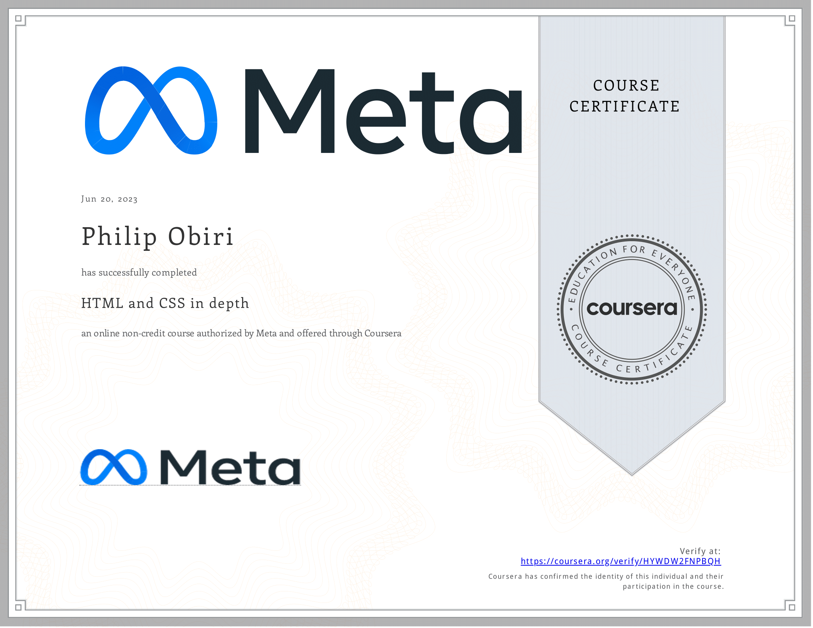

# HTML and CSS in depth

- This directory contains all of my assignments from the Coursera Course: [HTML and CSS in depth](https://www.coursera.org/learn/html-and-css-in-depth)

## Table of Content

- Week 1: [HTML in depth](https://github.com/philipObiri/Meta-Frontend-Professional-Certification-Program/tree/master/Course%204-%20Indepth%20HTML%20and%20CSS/Week%201%20-%20HTML%20Indepth)
- Week 2: [Interactive CSS](https://github.com/philipObiri/Meta-Frontend-Professional-Certification-Program/tree/master/Course%204-%20Indepth%20HTML%20and%20CSS/Week%202-Interactive%20CSS)
- Week 3: [Graded Assessment](https://github.com/philipObiri/Meta-Frontend-Professional-Certification-Program/tree/master/Course%204-%20Indepth%20HTML%20and%20CSS/Week%203-%20Graded%20Assesment)

## Proof of Completion

