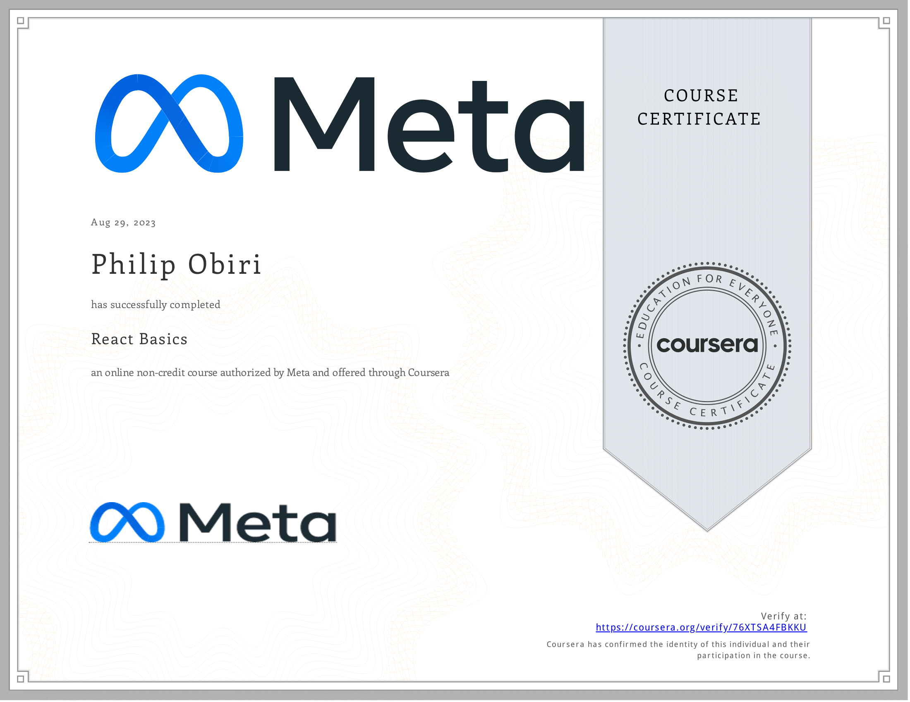

# React Basics

- This directory contains all of my assignments from the Coursera Course: [React Basics](https://www.coursera.org/learn/react-basics)

## Table of Content

- Week 1: [React Components](https://github.com/philipObiri/Meta-Frontend-Professional-Certification-Program/tree/master/Course%205-%20React%20Basics/Week%201-%20React%20Components)
- Week 2: [Data and State](https://github.com/philipObiri/Meta-Frontend-Professional-Certification-Program/tree/master/Course%205-%20React%20Basics/Week%202-%20Data%20and%20State)
- Week 3: [Navigation, Updating and Assets in React.js](https://github.com/philipObiri/Meta-Frontend-Professional-Certification-Program/tree/master/Course%205-%20React%20Basics/Week%203-%20Navigation%2C%20Updates%20and%20Assets%20in%20ReactJS)
- Week 4: [Your first React app](https://github.com/philipObiri/Meta-Frontend-Professional-Certification-Program/tree/master/Course%205-%20React%20Basics/Week%204%20-%20Your%20First%20React%20App)

## Proof of Completion

