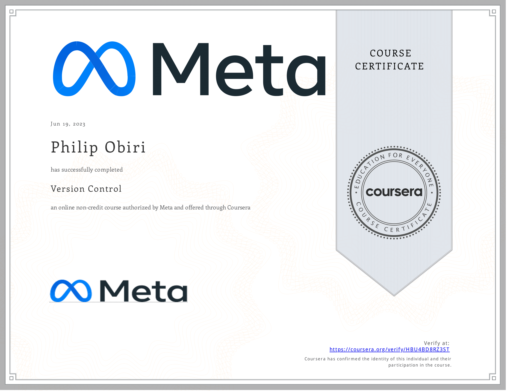

# Version Control

- This directory contains all of my assignments from the Coursera Course: [Version Control](https://www.coursera.org/learn/introduction-to-version-control?specialization=meta-front-end-developer)

## Table of Content

- Week 1: [Software collaboration](https://github.com/philipObiri/Meta-Frontend-Professional-Certification-Program/tree/master/Cousera%203-Version%20Control/Week%201-%20Software%20Collaboration)
- Week 2: [Command Line](https://github.com/philipObiri/Meta-Frontend-Professional-Certification-Program/tree/master/Cousera%203-Version%20Control/Week%202-%20Command%20Line)
- Week 3: [Working with Git](https://github.com/philipObiri/Meta-Frontend-Professional-Certification-Program/tree/master/Cousera%203-Version%20Control/Week%203-%20Working%20WIth%20Git)
- Week 4: [Graded Assessment](https://github.com/philipObiri/Meta-Frontend-Professional-Certification-Program/tree/master/Cousera%203-Version%20Control/Week%204-Graded%20Assessment)

## Proof of Completion

